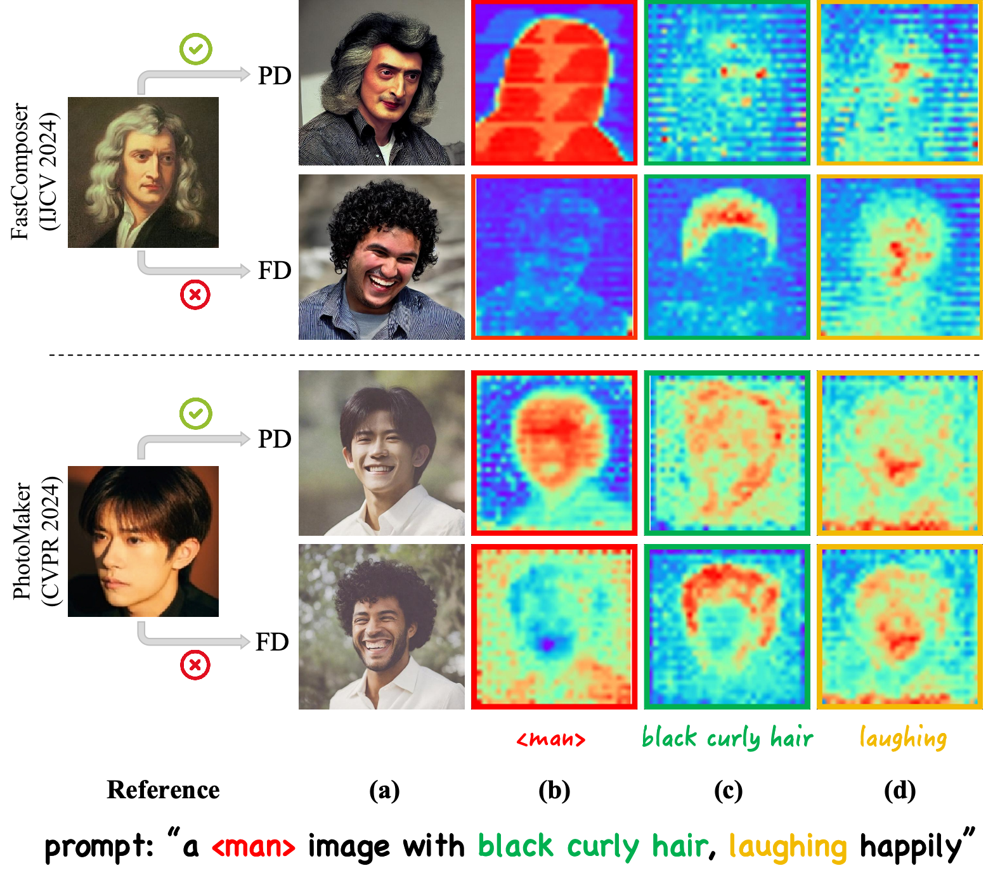
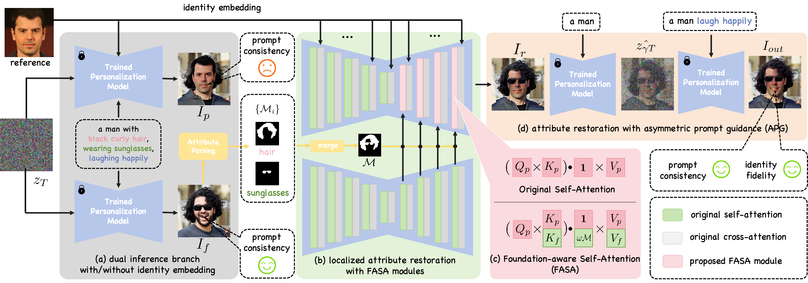
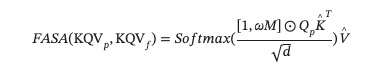
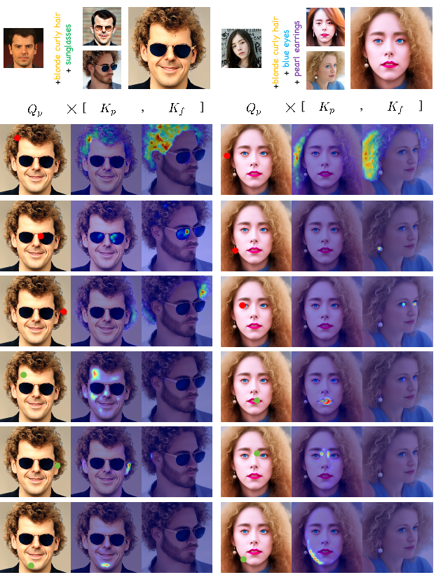

<!--
Hey, thanks for using the awesome-readme-template template.  
If you have any enhancements, then fork this project and create a pull request 
or just open an issue with the label "enhancement".

Don't forget to give this project a star for additional support ;)
Maybe you can mention me or this repo in the acknowledgements too
-->

<!--
This README is a slimmed down version of the original one.
Removed sections:
- Screenshots
- Running Test
- Deployment
- FAQ
- Acknowledgements
-->

  <h1>FreeCure</h1>
  

    This is the project page for the paper "Foundation Cures Personalization: Improving Personalized Models' Prompt Consistency via Hidden Foundation Knowledge"
  

> 2025.03 We upload the paper to [Arxiv](https://arxiv.org/abs/2411.15277).

## TL;DR
Personalization Models fail to control facial attributes accurately. FreeCure fixes this problem with a training-free framework without harming these models' impressive ability in maintaining identity information.

## Motivation
Personalization models fuse identity embedding into the cross-attention layers. Our preliminary experimental findings reveal that identity embeddings compromise the effectiveness of other tokens in the prompt, thereby limiting high prompt consistency and controllability. Moreover, by deactivating identity embedding, personalization models still demonstrate the underlying foundation models' ability of controlling multiple facial attributes precisely. It suggests that such foundation models' knowledge can be leveraged to **cure** the ill-aligned prompt consistency of personalization models.

## Method
As aforementioned, most personalization models focus on the cross-attention layers' interaction with identity embedding, keeping self-attention layers intact. Therefore, it is reasonable to assume that the "foundation knowledge" lies in self-attention layers. Therefore, we introduce a novel foundation-aware self-attention module coupled with an inversion-based process to bring well-aligned attribute information to the personalization process.

It should be emphasized that via attribute-aware masks, our proposed foundation-aware self-attention (FASA) is able to enhance different attributes in a fine-grained manner:

Generally, our proposed framework, **FreeCure**, has several advantages:
* It is totally training-free.
* It can enhance a broad range of facial attributes and significantly improve the personalization model's prompt consistency while not disrupting its well-trained ability for identity fidelity.
* It can be seamlessly integrated into a wide range of mainstream personalization models

## Results for FreeCure on Popular Personalization Baselines
Results on references sampling from [CelebA-HQ](https://mmlab.ie.cuhk.edu.hk/projects/CelebA.html):

Results on references randomly collected from webpages (non-celebrity identities):

## Visualization of FASA

Our visualization for the FASA map obviously proves that it can transfer well-aligned attributes into the original personalization model's generation, thus restoring ill-aligned attributes. For areas irrelevant to target attributes, FASA does not disrupt the personalization model's original attention pattern. This substantiates its performance in maintaining identity fidelity.

